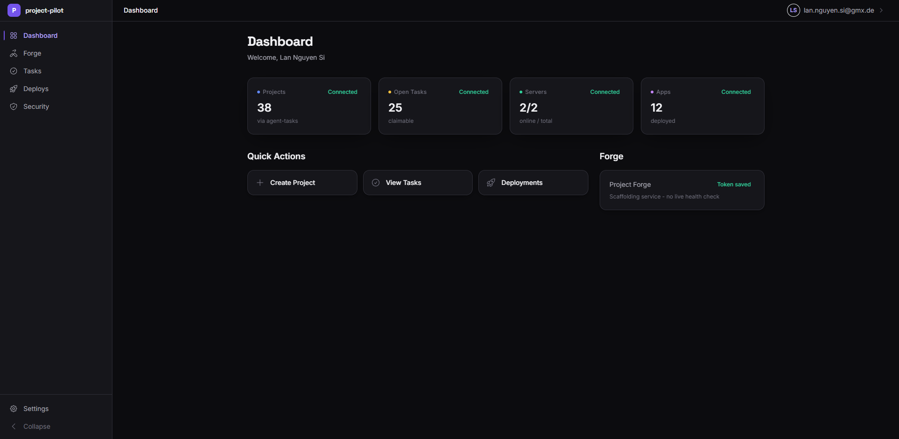

# project-pilot

Unified control plane for the full project lifecycle: **Create**, **Develop**, **Deploy**, all in one dashboard.

project-pilot aggregates three independent services, [project-forge](https://github.com/LanNguyenSi/project-forge) (scaffolding), [agent-tasks](https://github.com/LanNguyenSi/agent-tasks) (task management), and [deploy-panel](https://github.com/LanNguyenSi/deploy-panel) (VPS deploys), behind a single login. Service credentials are stored encrypted per-user, validated via **Test Connection** before save, and exposed to AI agents over a stdio MCP server. The backend is a thin Hono proxy with Zod-validated inputs; the frontend is Next.js 15 with a unified dark-mode UI.



```
                  ┌──────────────────────┐
                  │    project-pilot     │
                  │  (one login, one UI) │
                  └──────────┬───────────┘
                             │
        ┌────────────────────┼────────────────────┐
        ▼                    ▼                    ▼
  ┌───────────┐        ┌───────────┐        ┌───────────┐
  │  Create   │        │  Develop  │        │  Deploy   │
  │project-   │        │  agent-   │        │  deploy-  │
  │  forge    │        │   tasks   │        │   panel   │
  └───────────┘        └───────────┘        └───────────┘
```

## Try it in 60 seconds

```bash
git clone https://github.com/LanNguyenSi/project-pilot.git
cd project-pilot

# Install + start Postgres + push schema + run dev servers in one shot
make dev-full
```

`make dev-full` installs deps, starts the `db` container, generates the Prisma client, copies `.env.example` files if missing, pushes the schema, and starts both servers.

- Frontend: http://localhost:3000
- Backend:  http://localhost:3001

Then connect your existing service credentials:

1. Register an account at http://localhost:3000/login.
2. Open `/settings`.
3. Paste your `pf_...` Forge key, agent-tasks Bearer token, and `dp_...` Deploy key. Hit **Test Connection** on each.
4. Visit `/dashboard`, you should see aggregated stats from all three services.

Need to run pieces individually (no Docker, separate terminals, etc.)? See [docs/configuration.md](docs/configuration.md).

## What you get

### Create, project-forge

AI-powered project scaffolding. List existing projects, generate previews, and publish to GitHub from `/forge` and `/forge/create`.

### Develop, agent-tasks

Task management for human-agent collaboration. Browse projects and tasks, create tasks, and read agent instructions from `/tasks`; claiming and status transitions run through the agent-tasks API/MCP, not this UI. The backend also proxies the agent signals inbox (`GET /api/tasks/signals/inbox`) for API consumers; there is no inbox UI yet.

### Deploy, deploy-panel

VPS deployment management. List servers and apps, trigger deploys, watch status, run preflight checks, roll back, and filter history by server / app / status from `/deploys`.

## MCP server

The MCP server exposes 18 tools (forge, tasks, deploy, plus `dashboard_summary`) over stdio for Claude Code and other MCP clients.

```json
{
  "mcpServers": {
    "project-pilot": {
      "command": "npx",
      "args": ["tsx", "/path/to/project-pilot/mcp/src/index.ts"],
      "env": {
        "FORGE_API_KEY": "pf_...",
        "TASKS_TOKEN":   "at_...",
        "DEPLOY_API_KEY":"dp_..."
      }
    }
  }
}
```

The snippet above runs the server from source with `tsx`. Alternatively, run `npm run build` in `mcp/` and point the client at the compiled `project-pilot-mcp` bin (`mcp/dist/index.js`).

Full tool list and env reference: [docs/architecture.md](docs/architecture.md#mcp-surface).

## Key features

- Unified dark-mode dashboard with aggregated stats from all services
- Encrypted service credential storage with **Test Connection** validation
- Pagination and search on tasks, deploys, and projects
- Deploy history filters (by server, app, status)
- Password reset flow (forgot password / reset with token)
- Error boundaries for graceful failure handling
- Zod input validation on all API endpoints
- Security headers (CSP, HSTS) in production

## Next steps

| If you want to... | Read |
|------|------|
| See how project-pilot fits into the wider tool ecosystem | [docs/ecosystem.md](docs/ecosystem.md) |
| Understand the aggregation model and MCP surface | [docs/architecture.md](docs/architecture.md) |
| Configure env vars, credentials, password reset, Docker | [docs/configuration.md](docs/configuration.md) |
| Browse the HTTP API and Zod input validation | [docs/api.md](docs/api.md) |

## Setup (manual)

If you don't want `make dev-full`:

```bash
make install        # npm install at the root (workspaces: backend, frontend, mcp)
make docker-up      # start Postgres on :5432
make db-generate    # prisma generate
make db-push        # prisma db push

cp backend/.env.example backend/.env
cp frontend/.env.example frontend/.env

make dev            # backend on :3001, frontend on :3000
```

See [docs/configuration.md](docs/configuration.md) for env var reference.

## Production

```bash
docker compose -f docker-compose.prod.yml up --build -d
```

Exposes via Traefik at `project-pilot.opentriologue.ai` with automatic HTTPS. See [docs/configuration.md](docs/configuration.md#production-with-traefik).

## Roadmap

- [ ] Email notifications for password reset
- [ ] Request logging (structured access / error logs)
- [ ] User profile management (display name, avatar)
- [ ] Session management (list active sessions, revoke)

## License

MIT.
