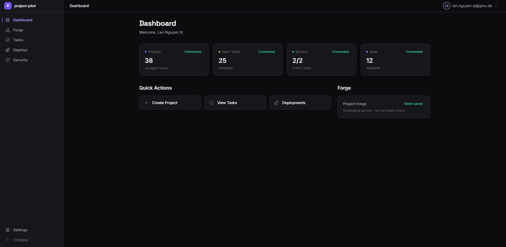

# project-pilot

Unified control plane for the full project lifecycle: **Create**, **Develop**, **Deploy**, all in one dashboard.

[](https://github.com/LanNguyenSi/project-pilot/actions/workflows/ci.yml) [](LICENSE)

## Overview

project-pilot aggregates three independent services, [project-forge](https://github.com/LanNguyenSi/project-forge) (scaffolding), [agent-tasks](https://github.com/LanNguyenSi/agent-tasks) (task management), and [deploy-panel](https://github.com/LanNguyenSi/deploy-panel) (VPS deploys), behind a single login. Service credentials are stored encrypted per-user, validated via **Test Connection** before save, and exposed to AI agents over a stdio MCP server. The backend is a thin Hono proxy with Zod-validated inputs; the frontend is Next.js 15 with a unified dark-mode UI.



## Key features

- Create (project-forge): scaffold, preview, and publish a project to GitHub from `/forge`
- Develop (agent-tasks): browse projects, create tasks, and read agent instructions from `/tasks`
- Deploy (deploy-panel): list servers/apps, trigger deploys, roll back, and filter history from `/deploys`
- Unified dark-mode dashboard with aggregated stats from all three services
- Encrypted per-user service credential storage with **Test Connection** validation
- MCP server exposing 18 tools (forge, tasks, deploy, plus `dashboard_summary`) over stdio
- Password reset flow (forgot password / reset with token)
- Security headers (CSP, HSTS in production) and Zod validation on all JSON request bodies

## Quick start

Prerequisites: Node.js >=20, Docker (for the Postgres container).

```bash
git clone https://github.com/LanNguyenSi/project-pilot.git
cd project-pilot

# Install + start Postgres + push schema + run dev servers in one shot
make dev-full
```

`make dev-full` installs deps, starts the `db` container, generates the Prisma client, copies `.env.example` files if missing, pushes the schema, and starts both servers.

- Frontend: http://localhost:3000
- Backend:  http://localhost:3001

Then connect your existing service credentials:

1. Register an account at http://localhost:3000/login.
2. Open `/settings`.
3. Paste your `pf_...` Forge key, agent-tasks Bearer token, and `dp_...` Deploy key. Hit **Test Connection** on each.
4. Visit `/dashboard`, you should see aggregated stats from all three services.

Need to run pieces individually (no Docker, separate terminals, etc.)? See [docs/configuration.md](docs/configuration.md#manual-setup).

## Usage

The MCP server exposes 18 tools (forge, tasks, deploy, plus `dashboard_summary`) over stdio for Claude Code and other MCP clients:

```json
{
  "mcpServers": {
    "project-pilot": {
      "command": "npx",
      "args": ["tsx", "/path/to/project-pilot/mcp/src/index.ts"],
      "env": {
        "FORGE_API_KEY": "pf_...",
        "TASKS_TOKEN":   "at_...",
        "DEPLOY_API_KEY":"dp_..."
      }
    }
  }
}
```

The snippet above runs the server from source with `tsx`. Alternatively, run `npm run build` in `mcp/` and point the client at the compiled `project-pilot-mcp` bin (`mcp/dist/index.js`).

Full tool list and env reference: [docs/architecture.md](docs/architecture.md#mcp-surface).

## Documentation

| If you want to... | Read |
|------|------|
| See how project-pilot fits into the wider tool ecosystem | [docs/ecosystem.md](docs/ecosystem.md) |
| Understand the aggregation model and MCP surface | [docs/architecture.md](docs/architecture.md) |
| Configure env vars, credentials, password reset, Docker | [docs/configuration.md](docs/configuration.md) |
| Browse the HTTP API and Zod input validation | [docs/api.md](docs/api.md) |
| See planned work | [docs/roadmap.md](docs/roadmap.md) |

## Development and contributing

See [CONTRIBUTING.md](CONTRIBUTING.md) for the dev setup, per-workspace build/test commands, and PR guidelines.

## License

MIT.
